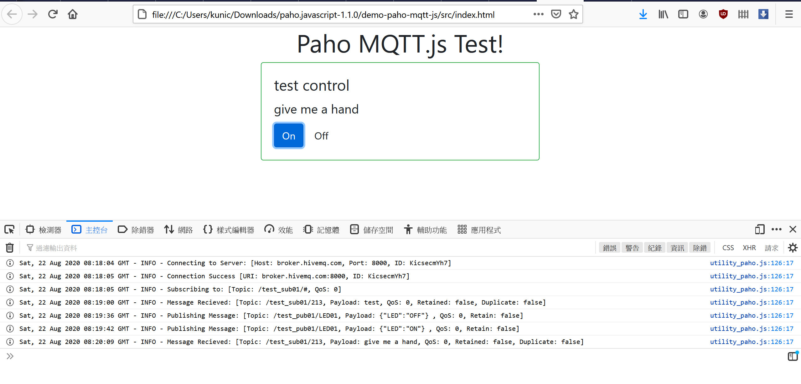

Testing javascript client of Paho Mqtt project
===

the code base on [[Web前端]使用paho MQTT.javascript来连接百度IOT(天工物接入)](https://blog.csdn.net/kimiyang123/article/details/81979561), change something for new version library for demo publish/subscribe mqtt message

---

### test screen

### use hiveMQ web client for testing

details in code, check [src](./src) folder
